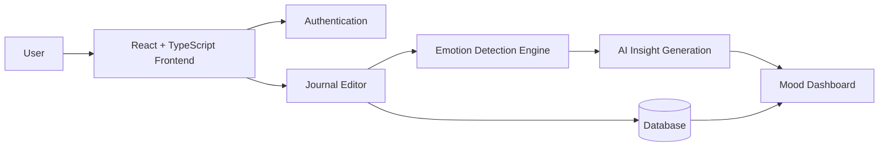
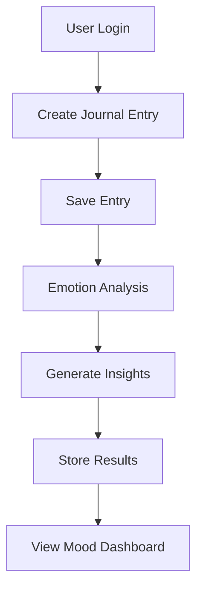
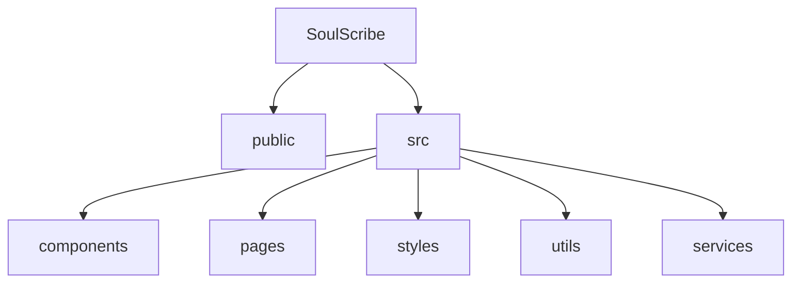
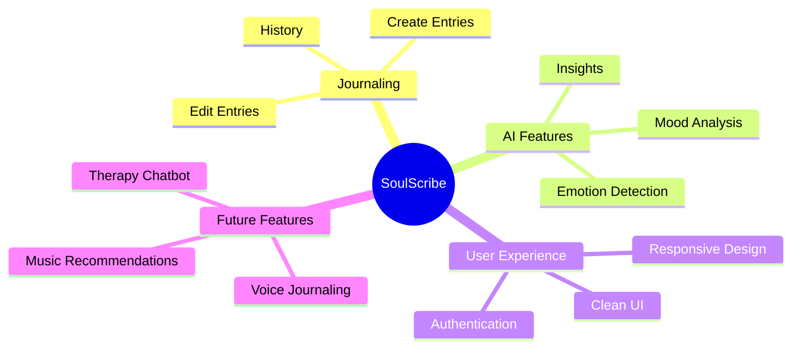
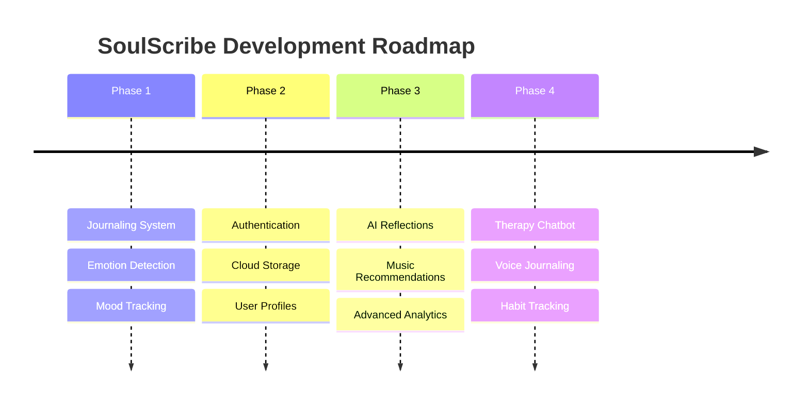

# 🌙 SoulScribe

> *An AI-powered emotionally aware journaling platform that helps users reflect, understand their emotions, and build healthier mindfulness habits.*


---

# ✨ Overview

**SoulScribe** is an AI-powered journaling application designed to make self-reflection more meaningful and accessible.

Users can freely express their thoughts while the platform analyzes journal entries to identify emotions, track mood patterns, and provide personalized insights. SoulScribe combines modern web technologies with Natural Language Processing (NLP) to create a calming digital space focused on emotional well-being.

Whether you're documenting your day, monitoring your mental wellness, or simply organizing your thoughts, SoulScribe helps transform journaling into a mindful and insightful experience.

---

# 🏗️ System Architecture



---

# 🧠 Key Features

### ✍️ Intelligent Journaling

* Create and manage journal entries
* Clean, distraction-free writing experience
* Personalized journaling workflow

### 😊 Emotion Detection

* NLP-powered sentiment analysis
* Emotion classification from journal text
* Automatic mood recognition

### 📈 Mood Insights

* Track emotional patterns over time
* Visualize mood trends
* Gain deeper self-awareness

### 🔒 Secure Experience

* User authentication
* Private journal storage
* Secure access to personal entries

### 📱 Responsive Design

* Mobile-friendly interface
* Optimized user experience across devices
* Modern and intuitive UI

---

# 📝 User Journey



---

# 🧠 Emotion Analysis Pipeline


---

# 🛠️ Tech Stack

## Frontend

* React
* TypeScript
* JavaScript
* CSS

## AI / NLP

* Natural Language Processing (NLP)
* Emotion Detection Pipeline
* Sentiment Analysis

## Backend & Database

* Supabase
* Authentication System
* Cloud Data Storage

## Development Tools

* Git
* GitHub
* VS Code

---

# 📂 Project Structure



```bash
SoulScribe/
│
├── public/
│
├── src/
│   ├── components/
│   ├── pages/
│   ├── styles/
│   ├── utils/
│   └── services/
│
├── package.json
├── tsconfig.json
└── README.md
```

---

# 🚀 Getting Started

## 1. Clone the Repository

```bash
git clone https://github.com/shaivip30/soulscribe.git
```

## 2. Navigate to Project Directory

```bash
cd soulscribe
```

## 3. Install Dependencies

```bash
npm install
```

## 4. Start Development Server

```bash
npm run dev
```

---

# 🌟 Why SoulScribe?

Most journaling applications focus solely on note-taking.

SoulScribe goes beyond traditional journaling by helping users:

* Understand emotional patterns
* Build self-awareness
* Practice mindfulness
* Reflect on personal growth
* Gain meaningful insights from everyday experiences

The goal is to create a safe and emotionally intelligent digital companion rather than just another note-taking application.

---

# 📊 Feature Overview



---

# 🔮 Future Roadmap



### Planned Enhancements

* 🤖 AI-generated reflections
* 🎵 Emotion-based music recommendations
* 🎙️ Voice journaling support
* 🔥 Streak and habit tracking
* 🌗 Dark/Light theme support
* 💬 AI therapy chatbot
* 📊 Advanced mood analytics

---

# 🤝 Contributing

Contributions are welcome!

```bash
# Fork the repository

# Create a new feature branch
git checkout -b feature/amazing-feature

# Commit your changes
git commit -m "Add amazing feature"

# Push to GitHub
git push origin feature/amazing-feature
```

Then open a Pull Request 🚀

---

# 📜 License

This project is licensed under the **MIT License**.

---

# 👨‍💻 Author

Made with ❤️ by **Shaivi Pandey**

GitHub: https://github.com/shaivip30

---

# ⭐ Support

If you found this project helpful:

* ⭐ Star the repository
* 🍴 Fork the project
* 🧠 Share feedback
* 🚀 Contribute to development

---

# 🔗 Repository

https://github.com/shaivip30/soulscribe
